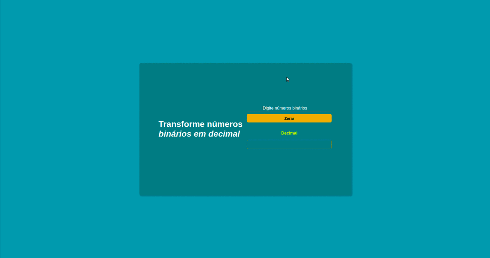

## #Convertion binary to decimal - Conversão de binário para decimal

Nesta aplicação, foi desenvolvido uma página web para conversão de numeros binários para numeros decimais, o input foi utilizado o type 'number' pois esta propriedade já dificulta a inserção de caracteres no input, recebendo apenas números. Porém, apenas números 0 e 1, quando o usuário colocar qualquer outro número além destes, será disparado na saída dos números decimais, que o mesmo não pode ser convertido para decimal, isto substitui o uso do método 'alert( )' que dificulta a experiência do usuário.

OBS: Outro ponto a se destacar, a conversão ocorre com apenas 8 dígitos binários, mostrando ao usuário de forma amigável que é o limite da sua conversão.

As tecnologias utilizadas foram:

- HTML
- CSS
- JAVASCRIPT

Para executar o código, é preciso clonar este repositório e abra-o o arquivo 'index.html' em um navegador.

Segue abaixo um gif da aplicação.

